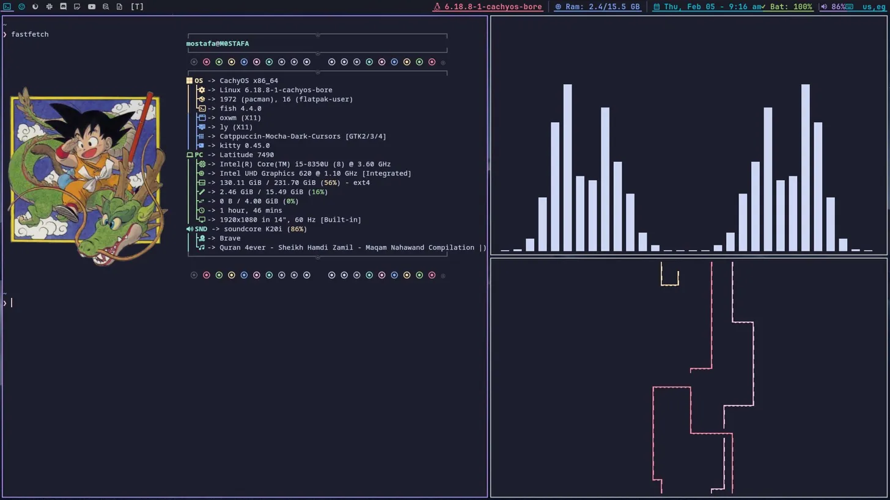
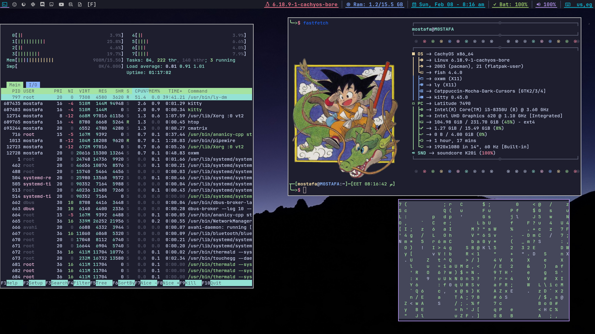

# OXWM Dotfile


My personal OXWM + fastfetch configs, feel free to try it out!




## What is OXWM?

OXWM is a dynamic window manager written in Rust, inspired by dwm but with modern improvements:
- Lua configuration with hot-reload (no recompiling!)
- LSP support for config autocomplete
- Keychord support for advanced keybindings
- Built-in status bar
- Multi-monitor support

Check out the [official repo](https://github.com/tonybanters/oxwm) for more info.

## My Setup (for reference)

- **OS**: CachyOS (Arch-based with performance optimizations)
- **WM**: OXWM
- **Terminal**: Kitty
- **Launcher**: Rofi
- **Browser**: Brave
- **Theme**: Tokyo Night
- **Font**: JetBrains Mono Nerd Font

## Features

- **Clean status bar** with kernel info, RAM usage, battery, volume, keyboard layout, and date/time
- **Workspace tags** using nerd font icons instead of numbers
- **Keychords** for advanced keybinds (Mod+Space + key combos)
- **Window rules** for auto-tagging apps to specific workspaces
- **Dual keyboard layout** (US/Arabic) with Alt+Shift toggle
- **Media controls** for PipeWire/WirePlumber
- **Modular config** with separate color scheme file

## Installation

### Dependencies

```bash
# Installing OXWM on Arch-based distros (NixOS tutorial in OXWM's official repo, any other distro can compile it from source)
yay -S oxwm-git

# Additional tools used in config
./install.sh 

OR (if you do not want to run scripts)
# replace yay with paru if you want
yay -S kitty brave-bin rofi flameshot maim xclip playerctl blueman thunar\
xwallpaper dunst network-manager-applet wireplumber xorg-setxkbmap gawk ttf-jetbrains-mono-nerd
```

### Installing the Config

```bash
# Clone this repo
git clone https://github.com/theidioticdev/oxwm-dotfile
cd oxwm-dotfile

# Backup existing config if you have one
mv ~/.config/oxwm /path/to/backup
mv ~/.config/fastfetch/config.jsonc /path/to/backup

# Copy config
cp -r ./oxwm ~/.config/
cp -r ./fastfetch ~/.config

# Copy wallpaper (adjust path as needed)
mkdir -p ~/path/to/wallpapers
cp ./walls ~/path/to/wallpapers/
# you do not need to use my wallpapers, if you have your set of walls, you can use them too
# Click Super + Shift + R to hot reload the config
```

## Usage

### Default Keybindings

| Keybind | Action |
|---------|--------|
| `Super + Q` | Spawn terminal |
| `Super + D` | Launch Rofi |
| `Super + C` | Kill focused window |
| `Super + Shift + Q` | Quit OXWM |
| `Super + Shift + R` | Hot reload config |
| `Super + 1-9` | Switch to workspace 1-9 |
| `Super + Shift + 1-9` | Move window to workspace 1-9 |
| `Super + J/K` | Focus next/previous window |
| `Super + H/L` | Decrease/increase master area |
| `Super + A` | Toggle gaps |
| `Super + Shift + F` | Toggle fullscreen |
| `Super + S` | Screenshot (Flameshot) |
| `Super + Shift + /` | Show keybind overlay |
| `Alt + Shift` | Change keyboard layout | 

### Keychords

| Sequence | Action |
|----------|--------|
| `Super + Space` → `T` | Spawn terminal |
| `Super + Space` → `B` | Launch Brave |
| `Super + Space` → `G` | Launch GIMP |
| `Super + Space` → `C` | Spawn NMTUI |
| `Super + Space` → `E` | Spawn Thunar |
### Media Keys

Standard media keys work for volume, play/pause, next/previous track.

## Customization

The config is located at `~/.config/oxwm/config.lua`.

### Changing Colors

Edit `~/.config/oxwm/tokyonight.lua` or replace it with your own color scheme file.

### Adding Keybinds

```lua
oxwm.key.bind({ modkey }, "YourKey", oxwm.spawn({ "your-command" }))
```

### Hot Reload

After making changes, press `Super + Shift + R` to reload without restarting X.

## Credits

- **OXWM** by [Tony](https://github.com/tonybanters/oxwm)
- **Tokyo Night color scheme** adapted from Tony's config
- Inspired by the dwm and tiling WM community

## Contributing

Feel free to fork this and adapt it to your needs. If you have suggestions or improvements, open an issue or PR!

## License

This config is provided as-is. Do whatever you want with it.
