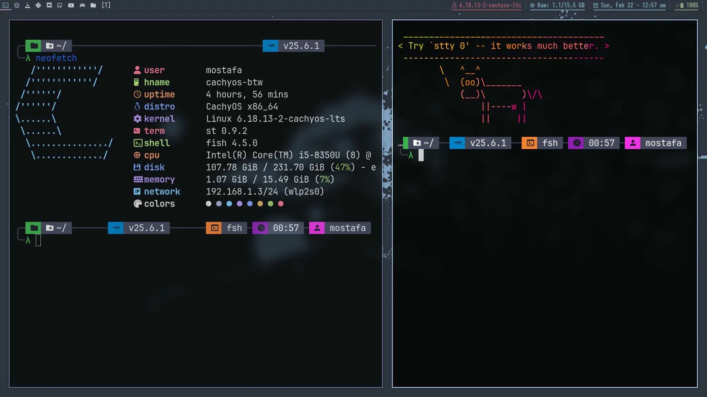
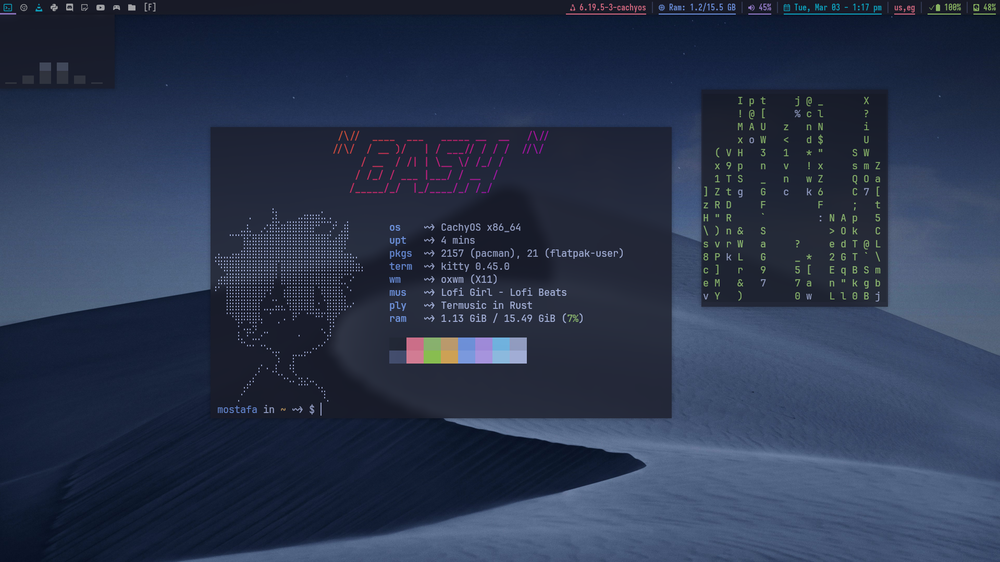

# OXWM Dotfile


My personal OXWM + fastfetch configs, feel free to try it out!




## What is OXWM?

OXWM is a dynamic window manager written in Zig, inspired by dwm but with modern improvements:
- Lua configuration with hot-reload (no recompiling!)
- LSP support for config autocomplete
- Keychord support for advanced keybindings
- Built-in status bar
- Multi-monitor support

Check out the [official repo](https://github.com/tonybanters/oxwm) for more info.

## My Setup (for reference)

- **OS**: CachyOS
- **Terminal**: Alacritty
- **Launcher**: Rofi
- **Browser**: Brave
- **Font**: Iosevka Mono Nerd Font
- **Themes included**: Catppuccin Mocha, Gruvbox, Tokyo Night, Nord, Oxocarbon

## Features

- **Status bar** with kernel info, RAM usage, battery, volume, storage usage, and date/time
- **Workspace tags** using nerd font icons instead of numbers
- **Keychords** for advanced keybinds (Mod+Space + key combos)
- **Window rules** for auto-tagging apps to specific workspaces
- **Dual keyboard layout** (US/Arabic) with Alt+Shift toggle
- **Media controls** for PipeWire/WirePlumber
- **Modular config** with separate color scheme file

## Installation

### Dependencies

```bash
# Installing OXWM on Arch-based distros (NixOS tutorial in OXWM's official repo, any other distro can compile it from source)
yay -S oxwm-git

# Dependencies installer
./install.sh 

OR (if you do not want to run scripts)
# replace yay with paru if you want
yay -S alacritty brave-bin rofi flameshot xclip playerctl blueman thunar \
xwallpaper dunst network-manager-applet wireplumber xorg-setxkbmap gawk ttf-iosevka-nerd \
zig lua libx11 libxft freetype2 fontconfig libxinerama
```

### Installing the Config

```bash
# Clone this repo
git clone https://github.com/theidioticdev/oxwm-dotfile
cd oxwm-dotfile

# Backup existing config if it exists (prevents errors if folder is missing)
[ -d ~/.config/oxwm ] && mv ~/.config/oxwm ~/.config/oxwm_backup
[ d ~/.config/fastfetch ] && mv ~/.config/fastfetch ~/.config/fastfetch_backup

# Copy config
cp -r ./oxwm ~/.config/
cp -r ./fastfetch ~/.config

# Copy wallpaper (adjust path as needed)
mkdir -p ~/dotfiles/  
cp -r ./walls ~/dotfiles/

# Before the next step, I recommend editing wallmenu so you can tweak the wallpaper directories
chmod +x wallmenu
sudo cp wallmenu /usr/local/bin/

# you do not need to use my wallpapers, if you have your set of walls, you can use them too
# Click Super + Shift + R to hot reload the config
```

## Usage

### Default Keybindings

| Keybind | Action |
|---------|--------|
| `Super + Q` | Spawn terminal |
| `Super + D` | Launch Rofi |
| `Super + C` | Kill focused window |
| `Super + Shift + Q` | Quit OXWM |
| `Super + Shift + R` | Hot reload config |
| `Super + 1-9` | Switch to workspace 1-9 |
| `Super + Shift + 1-9` | Move window to workspace 1-9 |
| `Super + J/K` | Focus next/previous window |
| `Super + H/L` | Decrease/increase master area |
| `Super + A` | Toggle gaps |
| `Super + Shift + F` | Toggle fullscreen |
| `Prt Sc` | Screenshot (Flameshot) |
| `Super + Shift + /` | Show keybind overlay |
| `Alt + Shift` | Change keyboard layout | 

### Keychords

| Sequence | Action |
|----------|--------|
| `Super + Space` → `M` | Spawn Termusic (using st, replace it with alacritty -e if you want) |
| `Super + Space` → `W` | Spawn Wallpaper/Theme Changer |
| `Super + Space` → `C` | Spawn NMTUI using kitty |
| `Super + Space` → `T` | Spawn a tmux session named "tmuxbtw" |

### Media Keys

Standard media keys work for volume, play/pause, next/previous track.

## Customization

The config is located at `~/.config/oxwm/config.lua`.

### Changing Colors
I included tonybanters' preset color scheme .lua files (tokyonight, gruvbox and nord)
Replace the scheme included in the dotfiles with your own color scheme file if you want.
for example:
```lua
local theme_name = "nord"
local colors = require(theme_name)
```

### Adding Keybinds

```lua
oxwm.key.bind({ modkey }, "YourKey", oxwm.spawn({ "your-command" }))
```

### Hot Reload

After making changes, press `Super + Shift + R` to reload without restarting X.

## Credits

- **OXWM** by [Tonybtw](https://github.com/tonybanters/oxwm)
- **Tokyo Night, Nord, and Gruvbox .lua files** adapted from Tony's config
## Contributing

Feel free to fork this and adapt it to your needs. If you have suggestions or improvements, open an issue or PR!

## License

This config is provided as-is. Do whatever you want with it.
